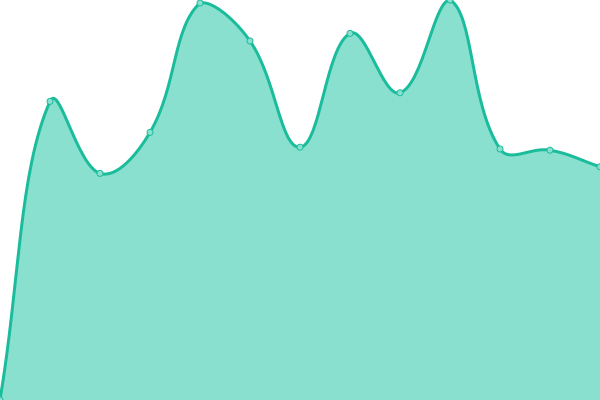
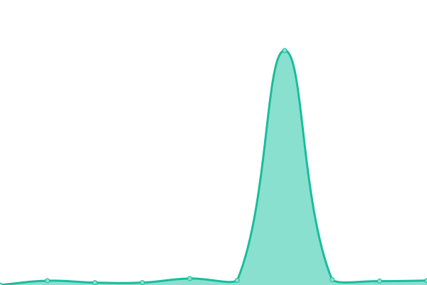
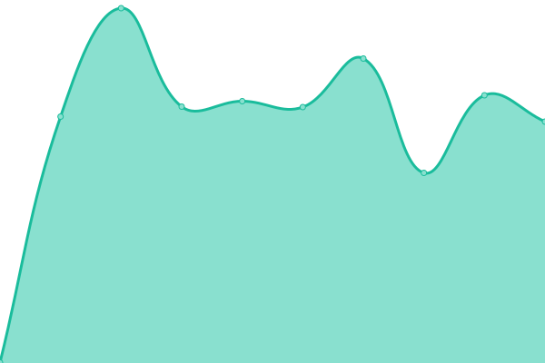

# [📈 Live Status](https://neonlabsorg.github.io/status): <!--live status--> **🟧 Partial outage**

This repository contains the open-source uptime monitor and status page for [Neon Labs](https://neon-labs.org/), powered by [Upptime](https://github.com/upptime/upptime).

With [Upptime](https://upptime.js.org), you can get your own unlimited and free uptime monitor and status page, powered entirely by a GitHub repository. We use [Issues](https://github.com/neonlabsorg/status/issues) as incident reports, [Actions](https://github.com/neonlabsorg/status/actions) as uptime monitors, and [Pages](https://neonlabsorg.github.io/status) for the status page.

<!--start: status pages-->
<!-- This summary is generated by Upptime (https://github.com/upptime/upptime) -->
<!-- Do not edit this manually, your changes will be overwritten -->
<!-- prettier-ignore -->
| URL | Status | History | Response Time | Uptime |
| --- | ------ | ------- | ------------- | ------ |
|  [NeonEVM website](https://neonevm.org) | 🟥 Down | [neon-evm-website.yml](https://github.com/neonlabsorg/status/commits/HEAD/history/neon-evm-website.yml) | 

 1135ms
     
 | 

<a href="https://status.neonevm.org/history/neon-evm-website">45.54%</a>
    

|  [Neonpass service](https://neonpass.live) | 🟩 Up | [neonpass-service.yml](https://github.com/neonlabsorg/status/commits/HEAD/history/neonpass-service.yml) | 

 210ms
     
 | 

<a href="https://status.neonevm.org/history/neonpass-service">100.00%</a>
    

|  [Neonscan service](https://neonscan.org) | 🟩 Up | [neonscan-service.yml](https://github.com/neonlabsorg/status/commits/HEAD/history/neonscan-service.yml) | 

 505ms
     
 | 

<a href="https://status.neonevm.org/history/neonscan-service">100.00%</a>
    

|  [Neonscan API](https://api.neonscan.org/block/lastest?offset=0&limit=1) | 🟩 Up | [neonscan-api.yml](https://github.com/neonlabsorg/status/commits/HEAD/history/neonscan-api.yml) | 

 531ms
     
 | 

<a href="https://status.neonevm.org/history/neonscan-api">100.00%</a>
    

|  [Mainnet proxy on P2P](https://neon-proxy-mainnet.solana.p2p.org) | 🟩 Up | [mainnet-proxy-on-p2-p.yml](https://github.com/neonlabsorg/status/commits/HEAD/history/mainnet-proxy-on-p2-p.yml) | 

 550ms
     
 | 

<a href="https://status.neonevm.org/history/mainnet-proxy-on-p2-p">52.20%</a>
    

|  [Mainnet proxy on Everstake](https://neon-mainnet.everstake.one) | 🟩 Up | [mainnet-proxy-on-everstake.yml](https://github.com/neonlabsorg/status/commits/HEAD/history/mainnet-proxy-on-everstake.yml) | 

 2952ms
     
 | 

<a href="https://status.neonevm.org/history/mainnet-proxy-on-everstake">0.00%</a>
    

|  [Devnet proxy](https://devnet.neonevm.org/solana) | 🟩 Up | [devnet-proxy.yml](https://github.com/neonlabsorg/status/commits/HEAD/history/devnet-proxy.yml) | 

 492ms
     
 | 

<a href="https://status.neonevm.org/history/devnet-proxy">100.00%</a>
    

<!--end: status pages-->

[**Visit our status website →**](https://neonlabsorg.github.io/status)

## 📄 License

- Powered by: [Upptime](https://github.com/upptime/upptime)
- Code: [MIT](./LICENSE) © [Anand Chowdhary](https://anandchowdhary.com), supported by [Pabio](https://pabio.com)
- Data in the `./history` directory: [Open Database License](https://opendatacommons.org/licenses/odbl/1-0/)
